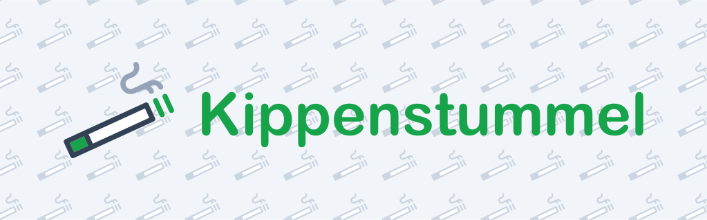

# Kippenstummel Web

> End user interface for Kippenstummel.

## Table of contents

- [Introduction](#introduction)
- [Deployment](#deployment)
- [Architecture](#architecture)
- [License](#license)
  - [Forbidden](#forbidden)

## Introduction

This is the browser based frontend of _Kippenstummel_, an application for
collaboratively recording and retrieving the locations of cigarette
vending machines.

## Deployment

The frontend client is generally operated on-premise. Because it is written with
[Next.js](https://nextjs.org/) as SSR (Server Side Rendering) application, it
requires a proper runtime environment to run (See [Operation](docs/operation.md)).
Besides the runtime environment, there are a few configuration settings that need
to be set (See [Configuration](docs/configuration.md)).

## Architecture

Kippenstummel Web is a web application based on SSG (Static Site Generation). The
following diagram shows the architecture of the application:

The application consists of three major parts:

- **Static File Server**: The static file server is responsible for serving the
  static files of the actual application, a multi-page application (MPA) built
  with [Next.js](https://nextjs.org/).
- **BFF Proxy**: The BFF (Backend For Frontend) proxy is responsible for proxying
  requests to the Kippenstummel API.
- **Tile Proxy**: The tile proxy is responsible for proxying requests to the tile
  server. It also caches the fetched map tiles.

The actual web application is browser-based and therefore runs on the client. Required
dynamic data is fetched from the BFF proxy, which in turn proxies the requests to
the Kippenstummel API. Core widget of the web application is the map view, which
is powered by the tile proxy. Tiles are not fetched directly from the tile server,
but are cached in the tile proxy.

## License

Copyright (c) 2025 Constantin Müller

[GNU AFFERO GENERAL PUBLIC LICENSE](https://www.gnu.org/licenses/) or [LICENSE](LICENSE) for
more details.

### Forbidden

**Hold Liable**: Software is provided without warranty and the software
author/license owner cannot be held liable for damages.
